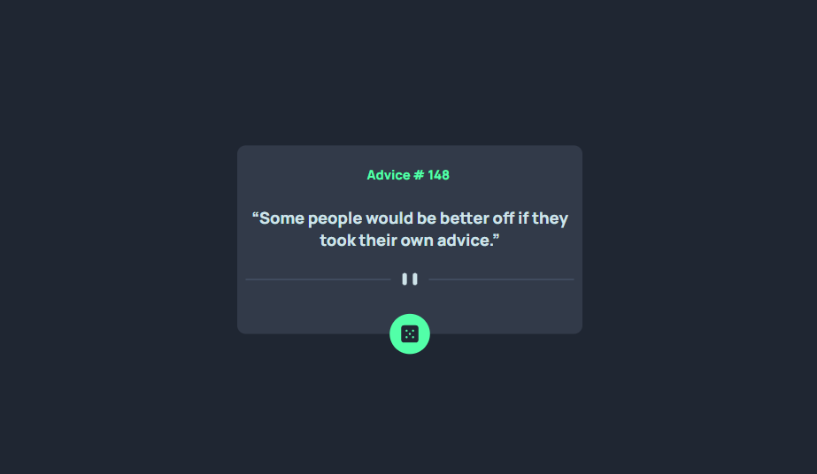
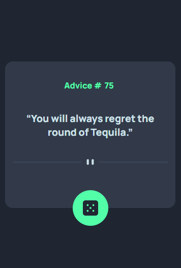

# Frontend Mentor - Advice generator app solution

This is a solution to the [Advice generator app challenge on Frontend Mentor](https://www.frontendmentor.io/challenges/advice-generator-app-QdUG-13db). Frontend Mentor challenges help you improve your coding skills by building realistic projects.

## Table of contents

- [Overview](#overview)
  - [The challenge](#the-challenge)
  - [Screenshot](#screenshot)
  - [Links](#links)
- [My process](#my-process)
  - [Built with](#built-with)
  - [What I learned](#what-i-learned)
  - [Useful resources](#useful-resources)
- [Author](#author)

**Note: Delete this note and update the table of contents based on what sections you keep.**

## Overview

### The challenge

Users should be able to:

- View the optimal layout for the app depending on their device's screen size
- See hover states for all interactive elements on the page
- Generate a new piece of advice by clicking the dice icon

### Screenshot
#### Desktop



#### Mobile



### Links

- Solution URL: [Advice Generator App Repository](https://your-solution-url.com)
- Live Site URL: [Advice Generator App](https://ronniiii-i.github.io/projects/advice-generator-app/)

## My process

### Built with

- Semantic HTML5 markup
- CSS custom properties
- Flexbox
- Javascript Promises


### What I learned

I learnt how to consume APIs using the fetch() method in javascript

```js
function generateAdvice() {
    fetch(adviceUrl)
    .then(response => response.json())
    .then((data)=> display(data))//function that will sort out the data object
    .catch( (error) => console.log(error))
}
```

### Useful resources

- [Consuming APIs Using JavaScript](https://medium.com/swlh/consuming-apis-using-javascript-c980abd36d59) - This helped me understand how to use javascript promises to fetch APIs. I will definitely be using it going forward.

## Author

- Frontend Mentor - [@ronniiii-i](https://www.frontendmentor.io/profile/ronniiii-i)
- Twitter - [@ronniiii_i](https://www.twitter.com/ronniiii_i)

